# UniERP Gap Analysis Visualizations
**Visual Gap Analysis Matrices and Implementation Timeline Charts**

---

## Phase 1 Gap Analysis Matrix

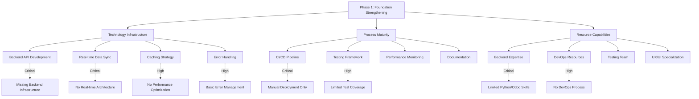

### Phase 1 Gap Severity Assessment

| Category | Critical | High | Medium | Low | Total Gaps |
|----------|----------|------|--------|-----|------------|
| Technology Infrastructure | 2 | 2 | 0 | 0 | 4 |
| Process Maturity | 1 | 1 | 1 | 1 | 4 |
| Resource Capabilities | 1 | 1 | 1 | 1 | 4 |
| **Total** | **4** | **4** | **2** | **2** | **12** |

---

## Phase 2 Gap Analysis Matrix

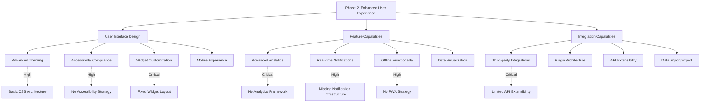

### Phase 2 Gap Severity Assessment

| Category | Critical | High | Medium | Low | Total Gaps |
|----------|----------|------|--------|-----|------------|
| User Interface Design | 1 | 2 | 1 | 0 | 4 |
| Feature Capabilities | 1 | 3 | 0 | 0 | 4 |
| Integration Capabilities | 1 | 1 | 2 | 0 | 4 |
| **Total** | **3** | **6** | **3** | **0** | **12** |

---

## Phase 3 Gap Analysis Matrix

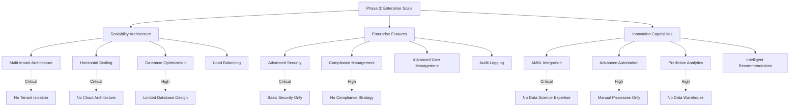

### Phase 3 Gap Severity Assessment

| Category | Critical | High | Medium | Low | Total Gaps |
|----------|----------|------|--------|-----|------------|
| Scalability Architecture | 2 | 2 | 0 | 0 | 4 |
| Enterprise Features | 1 | 2 | 1 | 0 | 4 |
| Innovation Capabilities | 1 | 3 | 0 | 0 | 4 |
| **Total** | **4** | **7** | **1** | **0** | **12** |

---

## Implementation Timeline Gantt Chart

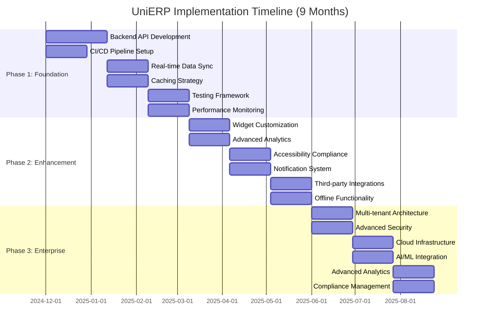

---

## Resource Allocation Timeline

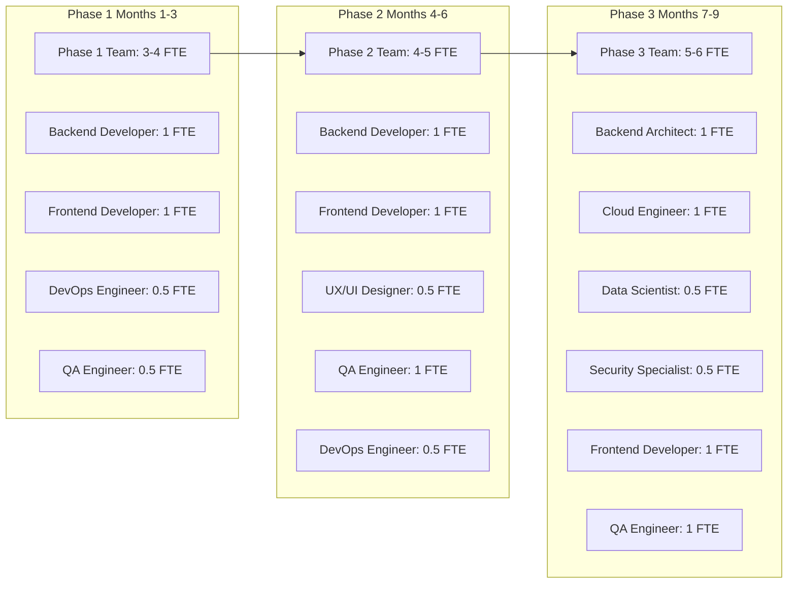

---

## Risk Assessment Heat Map

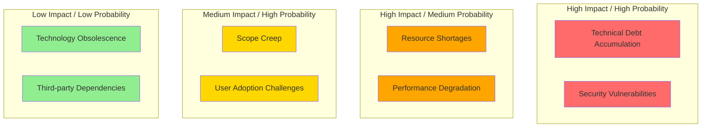

---

## Success Metrics Dashboard

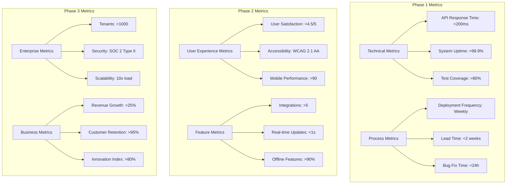

---

## Interdependency Flow Chart

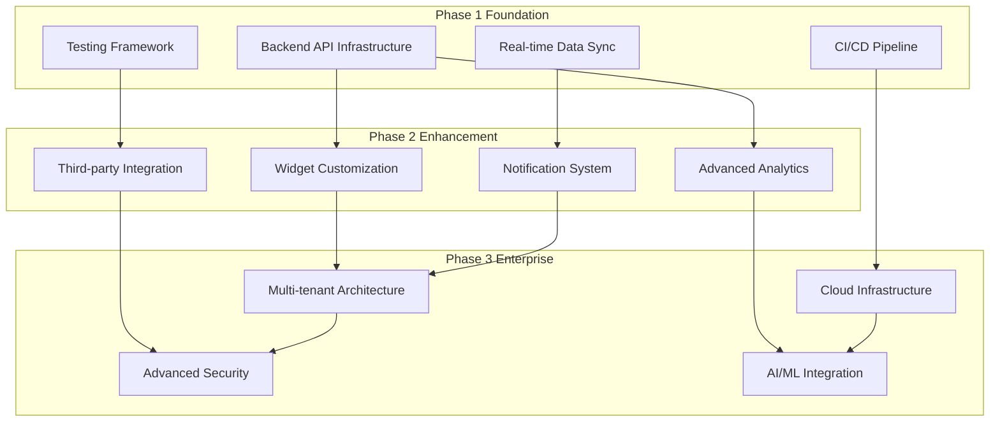

---

## Budget Allocation Visualization

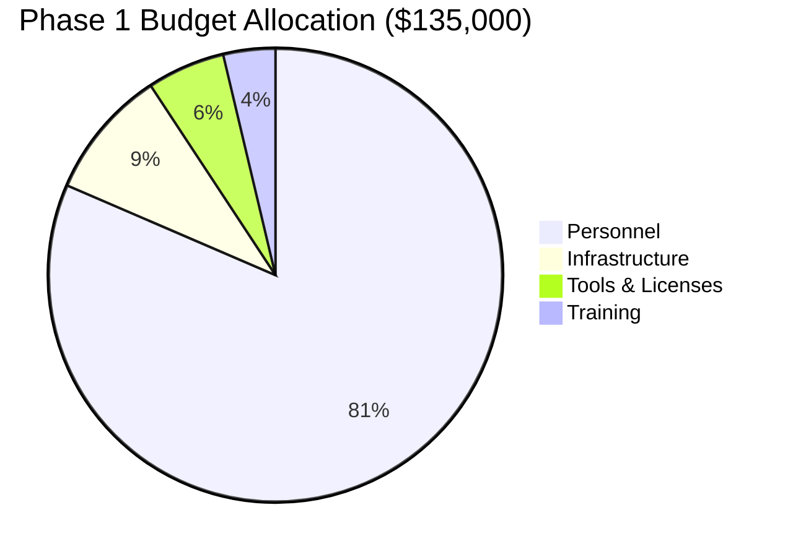

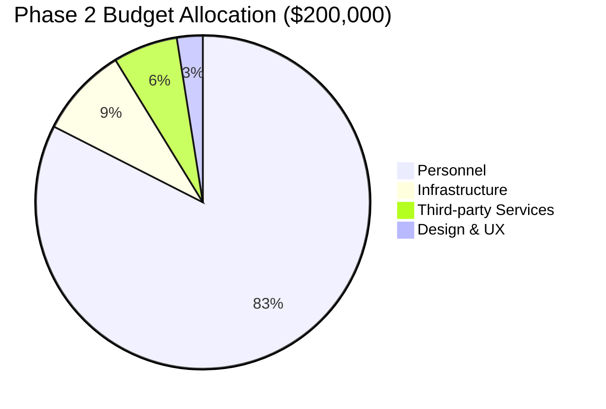

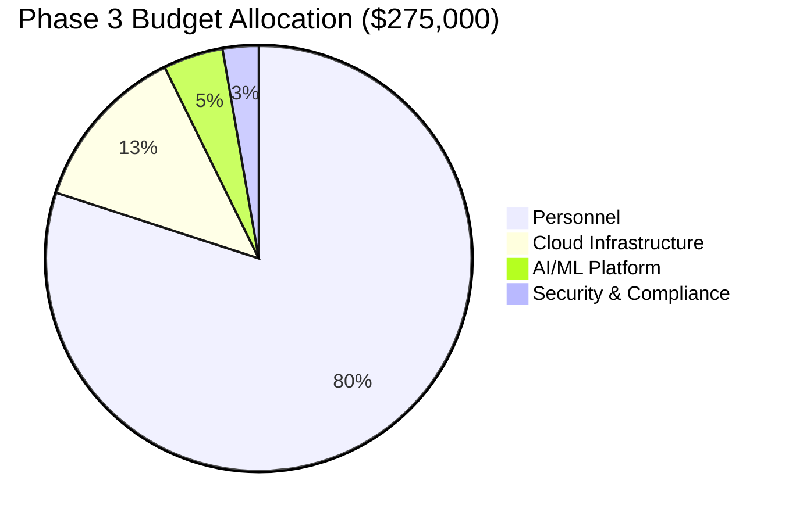

---

## Technology Stack Evolution

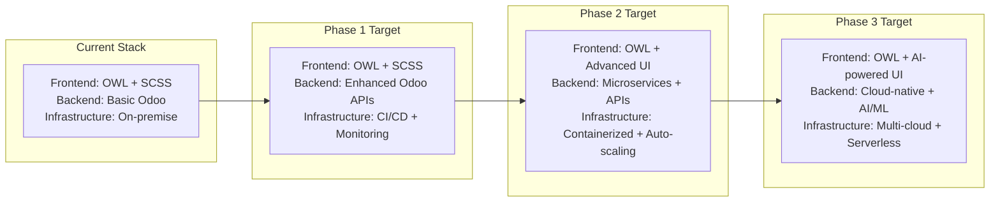

---

## Competitive Advantage Matrix

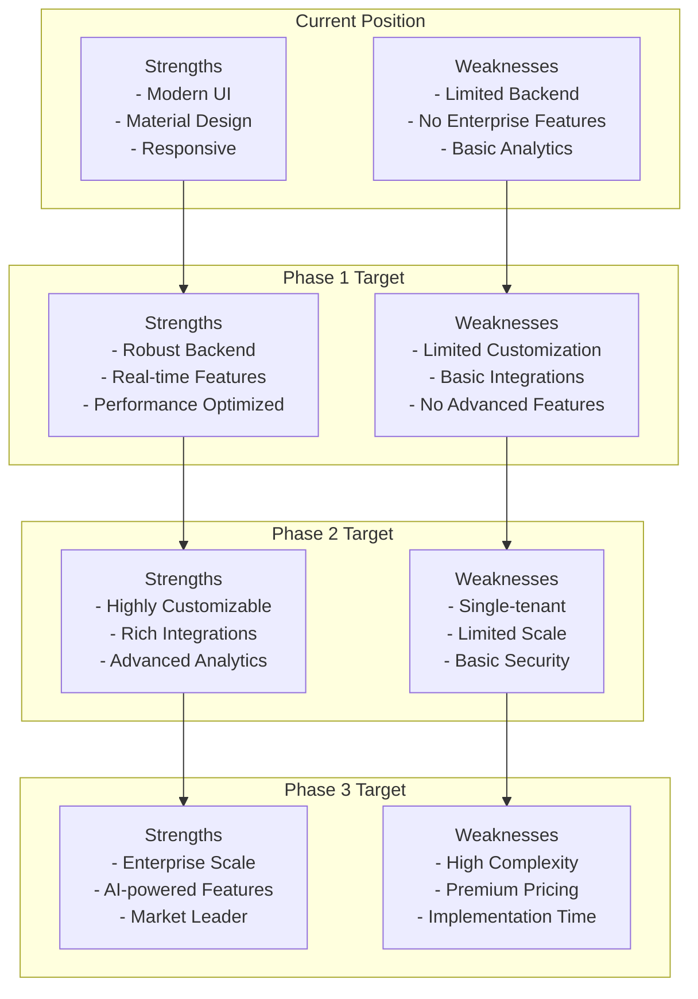

---

## User Journey Evolution

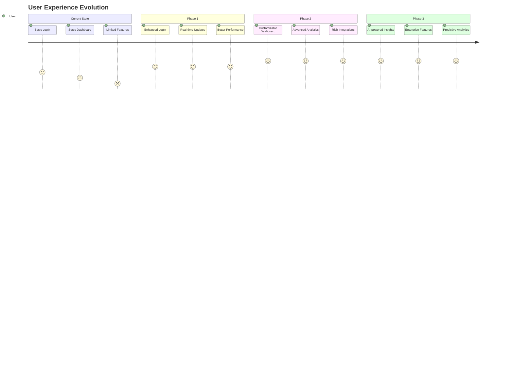

---

*Note: These visualizations complement the comprehensive gap analysis report and provide visual representations of the key findings, timelines, and implementation strategies.*