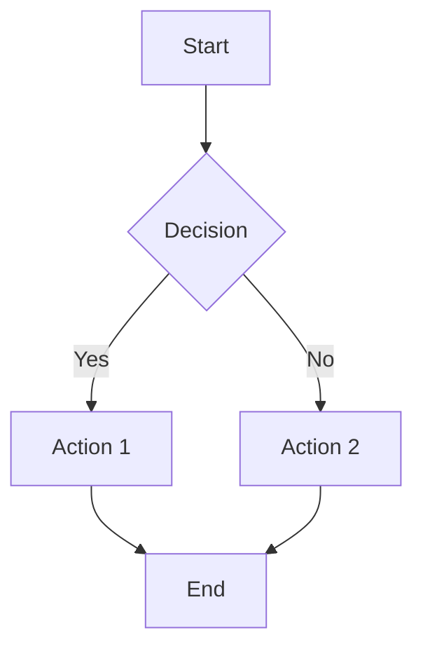

# UniERP Documentation Standards and Formatting Templates

## Table of Contents

1. [Document Structure Standards](#document-structure-standards)
2. [Formatting Guidelines](#formatting-guidelines)
3. [Template Library](#template-library)
4. [Brand Guidelines](#brand-guidelines)
5. [Quality Assurance](#quality-assurance)
6. [Publication Standards](#publication-standards)

---

## Document Structure Standards

### Standard Document Outline

#### Title Page
```markdown
# Document Title

**Version**: X.X  
**Date**: DD/MM/YYYY  
**Author**: [Author Name]  
**Department**: [Department]  
**Review Status**: [Draft/Review/Approved]  

---
```

#### Table of Contents
```markdown
## Table of Contents

1. [Section 1](#section-1)
2. [Section 2](#section-2)
3. [Section 3](#section-3)

---
```

#### Introduction Section
```markdown
## Introduction

### Purpose
[Brief description of document purpose and scope]

### Target Audience
[Description of intended readers]

### Prerequisites
[List of requirements or background knowledge needed]

---
```

#### Main Content Sections
```markdown
## Section Title

### Subsection
[Content with clear, concise explanations]

#### Key Points
- [Important point 1]
- [Important point 2]
- [Important point 3]

### Examples
[Practical examples or case studies]

---
```

#### Conclusion Section
```markdown
## Conclusion

### Summary
[Brief summary of key points]

### Next Steps
[Recommended actions or follow-up activities]

### References
[List of related documents or resources]

---
```

### Appendix Section
```markdown
## Appendix

### A: Technical Details
[Additional technical information]

### B: Glossary
[Definitions of key terms]

### C: Contact Information
[Support contacts and resources]
```

### Header Hierarchy Standards

#### Heading Levels
- **H1 (#)**: Document title only
- **H2 (##)**: Main sections
- **H3 (###)**: Subsections
- **H4 (####)**: Sub-subsections
- **H5 (#####)**: Minor points
- **H6 (######)**: Minimal use only

#### Section Numbering
- Main sections: Use Arabic numerals (1, 2, 3)
- Subsections: Use decimal numbering (1.1, 1.2, 1.3)
- Examples: Use lettered lists (A, B, C)
- Steps: Use numbered lists (1, 2, 3)

---

## Formatting Guidelines

### Text Formatting

#### Emphasis
```markdown
**Bold text** for important terms
*Italic text* for emphasis
***Bold and italic*** for strong emphasis
`Code formatting` for technical terms
```

#### Lists and Bullet Points
```markdown
#### Unordered Lists
- Main point
  - Sub-point
    - Sub-sub-point
  - Another sub-point
- Another main point

#### Ordered Lists
1. First step
2. Second step
   1. Sub-step 2.1
   2. Sub-step 2.2
3. Third step

#### Definition Lists
**Term**: Definition of the term
**Another Term**: Definition of another term
```

#### Tables
```markdown
| Column 1 | Column 2 | Column 3 |
|-----------|-----------|-----------|
| Data 1    | Data 2    | Data 3    |
| Data 4    | Data 5    | Data 6    |

*Table 1: Description of table contents*
```

### Code and Technical Content

#### Inline Code
```markdown
Use `backticks` for inline code references like `function_name()` or `variable_name`.
```

#### Code Blocks
```markdown
```python
def example_function():
    """Example function with proper formatting"""
    return "formatted_code"
```

```javascript
// JavaScript code example
const example = {
    key: "value",
    format: "consistent"
};
```
```

#### Command Line Examples
```markdown
```bash
# Command example with comments
$ command --parameter value
$ another-command --flag
```
```

### Links and References

#### Internal Links
```markdown
[Link Text](#section-anchor)
[Related Document](../path/to/document.md)
[Module Reference](../../modules/module-name.md)
```

#### External Links
```markdown
[UniERP Website](https://www.uslbd.com)
[Documentation](https://docs.uslbd.com)
[Support Portal](https://support.uslbd.com)
```

#### Email Addresses
```markdown
Contact: support@uslbd.com
Sales: sales@uslbd.com
```

### Images and Media

#### Image Formatting
```markdown


*Figure 1: Description of image content*
```

#### Diagrams and Flowcharts
```markdown

```

---

## Template Library

### User Guide Template

```markdown
# [Module Name] User Guide

**Version**: 1.0  
**Date**: [Current Date]  
**Author**: [Author Name]  
**Module**: [Module Name]  

---

## Overview

### Purpose
[Brief description of module purpose and benefits]

### Target Audience
[Description of intended users]

### Prerequisites
[List of requirements or background knowledge]

---

## Getting Started

### Initial Setup
[Step-by-step setup instructions]

### Basic Configuration
[Essential configuration steps]

---

## Key Features

### Feature 1
[Description and usage instructions]

### Feature 2
[Description and usage instructions]

---

## Common Tasks

### Task 1
[Step-by-step instructions]

### Task 2
[Step-by-step instructions]

---

## Troubleshooting

### Common Issues
[List of frequent problems and solutions]

### Error Messages
[Common error messages and resolutions]

---

## Best Practices

### Usage Tips
[Recommendations for effective use]

### Performance Optimization
[Tips for better performance]

---

## Support

### Contact Information
- **Email**: support@uslbd.com
- **Documentation**: https://docs.uslbd.com
- **Community**: https://community.uslbd.com

### Additional Resources
[List of related resources]
```

### Technical Documentation Template

```markdown
# [Technical Topic] Technical Guide

**Version**: 1.0  
**Date**: [Current Date]  
**Author**: [Author Name]  
**Audience**: Technical Staff, Developers  

---

## Technical Overview

### System Requirements
[Technical prerequisites]

### Architecture
[System architecture description]

### Dependencies
[List of dependencies and versions]

---

## Implementation

### Configuration Steps
[Technical configuration instructions]

### Code Examples
[Relevant code examples]

### API Reference
[API documentation snippets]

---

## Testing and Validation

### Test Procedures
[Testing instructions]

### Validation Criteria
[Success criteria]

---

## Troubleshooting

### Technical Issues
[Technical problems and solutions]

### Debug Information
[Debugging procedures]

---

## References

### Technical Specifications
[Links to technical specs]

### Related Documentation
[Links to related documents]
```

### Report Template

```markdown
# [Report Type] Report

**Report Period**: [Start Date] to [End Date]  
**Generated**: [Date]  
**Author**: [Author Name]  
**Department**: [Department]  

---

## Executive Summary

### Key Findings
[Summary of main findings]

### Recommendations
[List of recommendations]

---

## Detailed Analysis

### Section 1: [Topic]
[Detailed analysis with data]

### Section 2: [Topic]
[Detailed analysis with data]

---

## Data and Metrics

### Key Performance Indicators
| KPI | Target | Actual | Variance |
|-------|--------|--------|----------|
| KPI 1 | Value | Value | Difference |
| KPI 2 | Value | Value | Difference |

### Trends and Patterns
[Analysis of trends]

---

## Conclusion

### Summary
[Brief conclusion]

### Action Items
[List of follow-up actions]

---

## Appendices

### A: Raw Data
[Raw data or detailed tables]

### B: Methodology
[Explanation of methods used]

### C: Glossary
[Definitions of terms used]
```

---

## Brand Guidelines

### UniERP Brand Standards

#### Logo Usage
- **Primary Logo**: Use for official documents
- **Secondary Logo**: Use for internal documents
- **Minimum Size**: 100px width for digital
- **Clear Space**: Maintain clear space around logo

#### Color Palette
- **Primary Blue**: #1E3A8A
- **Secondary Blue**: #4A90E2
- **Accent Green**: #00A651
- **Text Dark**: #2C3E50
- **Text Light**: #FFFFFF

#### Typography
- **Headings**: Arial, bold
- **Body Text**: Arial, regular
- **Code**: Consolas, monospace
- **Sizes**: 
  - H1: 24px
  - H2: 20px
  - H3: 16px
  - Body: 14px

### Naming Conventions

#### Document Titles
- **Format**: [Module Name] [Document Type] Guide
- **Examples**: 
  - "Sales Management User Guide"
  - "Inventory Operations Manual"
  - "System Administration Guide"

#### File Naming
- **Format**: [Module]_[Type]_[Version].[Extension]
- **Examples**:
  - `Sales_UserGuide_v1.0.md`
  - `Inventory_Troubleshooting_v2.1.pdf`
  - `System_Admin_Manual_v3.0.docx`

#### Section Naming
- **Use Action-Oriented Titles**:
  - "Getting Started" instead of "Introduction"
  - "Creating Records" instead of "Data Entry"
  - "Managing Settings" instead of "Configuration"

### URL and Link Standards

#### Internal Links
- **Documentation**: https://docs.uslbd.com/[path]
- **Support**: https://support.uslbd.com/[topic]
- **Training**: https://training.uslbd.com/[course]

#### External References
- **Always use full URLs**
- **Include https:// protocol**
- **Test links before publishing**
- **Use descriptive link text**

---

## Quality Assurance

### Content Review Checklist

#### Structure and Organization
- [ ] Document follows standard outline
- [ ] Table of contents is complete
- [ ] Sections are logically organized
- [ ] Headers follow hierarchy rules
- [ ] Navigation links work correctly

#### Content Quality
- [ ] Information is accurate and current
- [ ] Language is clear and concise
- [ ] Technical terms are explained
- [ ] Examples are relevant and helpful
- [ ] Instructions are step-by-step

#### Formatting Consistency
- [ ] Markdown formatting is correct
- [ ] Code blocks use proper syntax highlighting
- [ ] Tables are properly formatted
- [ ] Links are functional and descriptive
- [ ] Images have alt text and captions

#### Brand Compliance
- [ ] UniERP branding is consistent
- [ ] Logo usage follows guidelines
- [ ] Color scheme is appropriate
- [ ] Typography follows standards
- [ ] Naming conventions are applied

### Review Process

#### Peer Review
1. **Initial Review**: Content accuracy and completeness
2. **Technical Review**: Code examples and technical accuracy
3. **Brand Review**: Branding and formatting compliance
4. **Final Review**: Overall quality and readiness

#### Approval Workflow
1. **Author Review**: Self-review and corrections
2. **Peer Review**: Feedback from subject matter experts
3. **Editorial Review**: Language and formatting review
4. **Approval**: Final sign-off and publication

---

## Publication Standards

### Version Control

#### Document Versioning
- **Format**: Major.Minor (e.g., 1.0, 1.1, 2.0)
- **Major Changes**: New features, major rewrites
- **Minor Changes**: Corrections, additions, improvements
- **Version History**: Maintain change log in document

#### Change Management
```markdown
## Version History

### Version 1.0 (DD/MM/YYYY)
- Initial release
- Core functionality documentation

### Version 1.1 (DD/MM/YYYY)
- Added troubleshooting section
- Updated screenshots
- Fixed typos and errors

### Version 2.0 (DD/MM/YYYY)
- Complete restructure
- Added new module coverage
- Updated branding guidelines
```

### Publication Formats

#### Digital Formats
- **Primary**: Markdown (.md) for web and version control
- **Secondary**: PDF for distribution and printing
- **Tertiary**: Word (.docx) for external contributors

#### Print Standards
- **Page Size**: A4 (210 × 297 mm)
- **Margins**: 2.5 cm all sides
- **Font**: Arial, 12pt body text
- **Header/Footer**: Document title and page numbers

### Accessibility Standards

#### Web Content
- **Alt Text**: All images have descriptive alt text
- **Link Text**: Descriptive text for all links
- **Contrast**: Sufficient color contrast for readability
- **Structure**: Proper heading hierarchy for screen readers

#### PDF Documents
- **Bookmarks**: Navigation bookmarks for PDFs
- **Tags**: Document properties for searchability
- **Text**: Selectable and searchable text
- **Tables**: Proper table structure for accessibility tools

---

## Template Examples

### Quick Start Guide Template
```markdown
# [Product/Module] Quick Start Guide

## 5-Minute Setup

1. **Log In**: Access your UniERP instance at [URL]
2. **Navigate**: Go to [Module] → [Function]
3. **Configure**: Set up [key settings]
4. **Test**: Verify configuration with [test action]

## First Tasks

### Task 1: [Task Name]
[3-4 step instructions]

### Task 2: [Task Name]
[3-4 step instructions]

### Task 3: [Task Name]
[3-4 step instructions]

## Need Help?

- **Documentation**: https://docs.uslbd.com/[module]
- **Support**: support@uslbd.com
- **Training**: https://training.uslbd.com/[course]
```

### FAQ Template
```markdown
# Frequently Asked Questions

## General Questions

**Q: [Question 1]?**
A: [Detailed answer with step-by-step guidance]

**Q: [Question 2]?**
A: [Detailed answer with step-by-step guidance]

## Module-Specific Questions

**Q: [Module-specific question 1]?**
A: [Module-specific answer]

**Q: [Module-specific question 2]?**
A: [Module-specific answer]

## Still Need Help?

Contact our support team:
- **Email**: support@uslbd.com
- **Phone**: +1-555-UNIERP (864377)
- **Chat**: Available at https://support.uslbd.com
```

---

## Implementation Tools

### Recommended Software

#### Authoring Tools
- **Text Editors**: Visual Studio Code, Sublime Text
- **Markdown Editors**: Typora, Mark Text, Obsidian
- **Grammar Check**: Grammarly, Hemingway Editor
- **Version Control**: Git with proper branching strategy

#### Design Tools
- **Diagram Creation**: Draw.io, Lucidchart, Mermaid
- **Image Editing**: GIMP, Photoshop, Canva
- **Screenshot Tools**: Snagit, Lightshot, Greenshot

#### Publishing Tools
- **PDF Generation**: Pandoc, Markdown PDF export
- **Web Publishing**: Static site generators, content management
- **Version Control**: GitHub, GitLab, Bitbucket

### Automation Tools

#### Content Validation
- **Link Checking**: Markdown link validation tools
- **Spell Checking**: Automated spell check integration
- **Format Validation**: Markdown linting tools
- **Brand Compliance**: Automated brand guideline checking

#### Template Management
- **Template Libraries**: Centralized template storage
- **Version Control**: Template versioning and updates
- **Distribution**: Automated template distribution
- **Feedback Collection**: Template improvement processes

---

## Conclusion

These documentation standards ensure:
- **Consistency**: All documents follow the same structure
- **Quality**: High-quality content with proper review
- **Brand Compliance**: Consistent UniERP branding
- **Accessibility**: Documents are accessible to all users
- **Maintainability**: Easy to update and maintain

### Training and Support

For assistance with documentation standards:
- **Documentation Team**: docs@uslbd.com
- **Style Guide Questions**: style@uslbd.com
- **Template Requests**: templates@uslbd.com
- **Quality Assurance**: qa@uslbd.com

### Resources

- **Complete Guide**: https://docs.uslbd.com/standards
- **Template Library**: https://docs.uslbd.com/templates
- **Brand Guidelines**: https://docs.uslbd.com/brand
- **Training Materials**: https://training.uslbd.com/documentation

Remember that consistent, high-quality documentation is essential for user success and satisfaction.