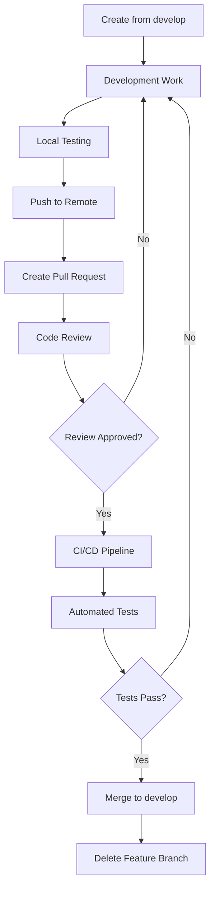
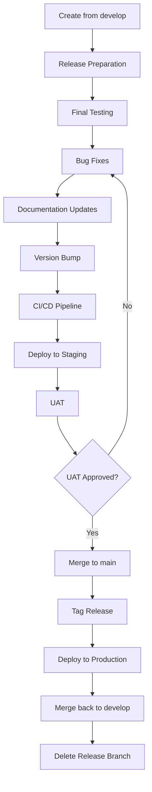
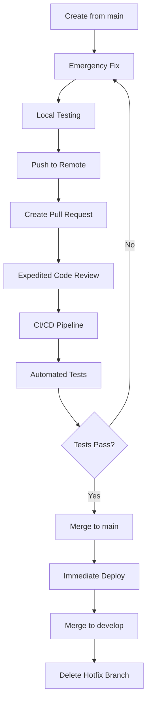

# UniERP - Git Branching Strategy

## Overview

This document defines the robust Git workflow and branching strategy for the UniERP project, based on Odoo 19 Community Edition rebranding. This strategy ensures organized development, seamless collaboration, and reliable deployment processes while maintaining code quality and system stability.

## Table of Contents

1. [Branch Types](#branch-types)
2. [Branch Naming Conventions](#branch-naming-conventions)
3. [Branch Lifecycle Management](#branch-lifecycle-management)
4. [Merge Protocols](#merge-protocols)
5. [CI/CD Integration](#cicd-integration)
6. [Release Management](#release-management)
7. [Code Review Process](#code-review-process)
8. [Emergency Procedures](#emergency-procedures)
9. [Branch Protection Rules](#branch-protection-rules)
10. [Tools and Automation](#tools-and-automation)

---

## Branch Types

### Main Branches

#### `main`
- **Purpose**: Production-ready code that is currently deployed or ready for deployment
- **Protection**: Fully protected, requires pull request and approval
- **Stability**: Always stable, tested, and deployable
- **Source**: Only accepts merges from `develop`, `release/*`, and `hotfix/*` branches

#### `develop`
- **Purpose**: Integration branch for active development
- **Protection**: Protected, requires pull request and approval
- **Stability**: Should be reasonably stable but may contain incomplete features
- **Source**: Accepts merges from `feature/*` branches

### Supporting Branches

#### `feature/*`
- **Purpose**: Development of new features or functionality
- **Lifespan**: Temporary, deleted after merge
- **Source**: Created from `develop`
- **Destination**: Merged back to `develop`

#### `release/*`
- **Purpose**: Preparation for production releases
- **Lifespan**: Temporary, deleted after release
- **Source**: Created from `develop`
- **Destination**: Merged to both `main` and `develop`

#### `hotfix/*`
- **Purpose**: Critical fixes for production issues
- **Lifespan**: Temporary, deleted after merge
- **Source**: Created from `main`
- **Destination**: Merged to both `main` and `develop`

---

## Branch Naming Conventions

### Feature Branches
```
feature/BRAND-123-login-page-rebranding
feature/BRAND-124-email-template-updates
feature/BRAND-125-api-documentation
```

### Release Branches
```
release/v1.0.0
release/v1.1.0
release/v2.0.0-beta
```

### Hotfix Branches
```
hotfix/BRAND-126-critical-security-fix
hotfix/BRAND-127-production-bug-fix
hotfix/BRAND-128-data-corruption-issue
```

### Documentation Branches
```
docs/BRAND-129-api-documentation-update
docs/BRAND-130-user-manual-revision
```

### Naming Guidelines
- Use kebab-case for all branch names
- Include ticket/issue number for traceability
- Keep names descriptive but concise (max 50 characters)
- Use lowercase letters only
- Avoid special characters except hyphens

---

## Branch Lifecycle Management

### Feature Branch Lifecycle



### Release Branch Lifecycle



### Hotfix Branch Lifecycle



---

## Merge Protocols

### Merge Strategies

#### Feature to Develop
- **Strategy**: Squash and merge
- **Purpose**: Maintain clean history
- **Requirements**: 
  - All tests passing
  - Code review approved
  - Documentation updated
  - No merge conflicts

#### Release to Main
- **Strategy**: Create merge commit
- **Purpose**: Preserve release history
- **Requirements**:
  - All tests passing
  - UAT approved
  - Release notes prepared
  - Version tagged

#### Hotfix to Main
- **Strategy**: Create merge commit
- **Purpose**: Preserve hotfix history
- **Requirements**:
  - Critical fix verified
  - Minimal regression testing
  - Security review (if applicable)

### Merge Conflict Resolution

1. **Prevention**:
   - Regular rebasing of feature branches
   - Small, frequent commits
   - Early communication of overlapping work

2. **Resolution Process**:
   - Identify conflicting files
   - Communicate with involved developers
   - Resolve conflicts collaboratively
   - Test resolution thoroughly
   - Document resolution in commit message

3. **Escalation**:
   - Technical Lead involvement for complex conflicts
   - Team discussion for architectural conflicts
   - Project Manager approval for timeline impacts

---

## CI/CD Integration

### Automated Pipeline Stages

```yaml
# Example GitLab CI/CD Configuration
stages:
  - lint
  - test
  - security
  - build
  - deploy-staging
  - deploy-production

variables:
  PYTHON_VERSION: "3.10"
  ODOO_VERSION: "19.0"

# Linting Stage
lint_code:
  stage: lint
  script:
    - pip install flake8 pylint black
    - flake8 --max-line-length=120 odoo/ addons/
    - pylint --disable=C0114,C0115 odoo/
    - black --check odoo/ addons/
  only:
    - merge_requests
    - develop
    - main

# Testing Stage
run_tests:
  stage: test
  script:
    - pip install -r requirements.txt
    - python3 unierp-bin -d test_db --test-enable --stop-after-init
    - python3 -m pytest tests/ --cov=odoo --cov-report=xml
  coverage: '/TOTAL.*\s+(\d+%)$/'
  artifacts:
    reports:
      coverage_format: cobertura
      path: coverage.xml
  only:
    - merge_requests
    - develop
    - release/*
    - hotfix/*

# Security Scan
security_scan:
  stage: security
  script:
    - pip install bandit safety
    - bandit -r odoo/ -f json -o bandit-report.json
    - safety check --json --output safety-report.json
  artifacts:
    reports:
      path: 
        - bandit-report.json
        - safety-report.json
  only:
    - merge_requests
    - develop
    - release/*
    - hotfix/*

# Build Stage
build_package:
  stage: build
  script:
    - python3 setup.py sdist bdist_wheel
    - tar -czf unierp-${CI_COMMIT_TAG:-latest}.tar.gz dist/
  artifacts:
    paths:
      - unierp-*.tar.gz
  only:
    - release/*
    - hotfix/*
    - main

# Deploy to Staging
deploy_staging:
  stage: deploy-staging
  script:
    - ssh deploy@staging "cd /opt/unierp && git fetch && git checkout $CI_COMMIT_SHA"
    - ssh deploy@staging "cd /opt/unierp && pip install -r requirements.txt --upgrade"
    - ssh deploy@staging "cd /opt/unierp && python3 unierp-bin -d unierp_staging -u all --stop-after-init"
    - ssh deploy@staging "systemctl restart unierp"
  environment:
    name: staging
    url: https://staging.unierp.uslbd.com
  only:
    - develop
    - release/*

# Deploy to Production
deploy_production:
  stage: deploy-production
  script:
    - ssh deploy@production "cd /opt/unierp && git fetch && git checkout $CI_COMMIT_TAG"
    - ssh deploy@production "cd /opt/unierp && pip install -r requirements.txt --upgrade"
    - ssh deploy@production "cd /opt/unierp && python3 unierp-bin -d unierp_prod -u all --stop-after-init"
    - ssh deploy@production "systemctl restart unierp"
  environment:
    name: production
    url: https://erp.uslbd.com
  when: manual
  only:
    - main
```

### Quality Gates

1. **Code Quality**:
   - Minimum test coverage: 80%
   - Zero critical linting issues
   - No security vulnerabilities

2. **Performance**:
   - Page load time < 2 seconds
   - Database query optimization
   - Memory usage within limits

3. **Security**:
   - No critical security issues
   - Dependency vulnerability scan
   - Code security analysis

---

## Release Management

### Version Numbering

Following Semantic Versioning 2.0.0: `MAJOR.MINOR.PATCH`

- **MAJOR**: Breaking changes or major feature releases
- **MINOR**: New features, backward compatible
- **PATCH**: Bug fixes, backward compatible

### Release Process

1. **Preparation**:
   - Create release branch from `develop`
   - Update version numbers
   - Complete release notes
   - Final testing

2. **Release**:
   - Merge to `main`
   - Create Git tag
   - Deploy to production
   - Update documentation

3. **Post-Release**:
   - Merge back to `develop`
   - Delete release branch
   - Announce release
   - Monitor production

### Release Schedule

- **Major Releases**: Quarterly
- **Minor Releases**: Monthly
- **Patch Releases**: As needed (hotfixes)

### Release Notes Template

```markdown
# UniERP v{VERSION} Release Notes

## Release Date: {DATE}

## 🚀 New Features
- [Feature description]
- [Feature description]

## 🐛 Bug Fixes
- [Bug fix description]
- [Bug fix description]

## 🔧 Improvements
- [Improvement description]
- [Improvement description]

## 🔒 Security Updates
- [Security fix description]

## 📋 Known Issues
- [Known issue description]

## 🔄 Upgrade Instructions
- [Upgrade steps]

## 📚 Documentation
- [Documentation updates]

## 🙏 Acknowledgments
- [Contributor names]
```

---

## Code Review Process

### Pull Request Requirements

1. **Title**:
   - Clear and descriptive
   - Include ticket number
   - Follow format: `BRAND-123: Brief description`

2. **Description**:
   - Problem statement
   - Solution approach
   - Testing performed
   - Breaking changes (if any)
   - Screenshots (for UI changes)

3. **Assignees**:
   - At least one code reviewer
   - Technical Lead for complex changes
   - QA Engineer for testing requirements

### Review Checklist

#### Code Quality
- [ ] Code follows project standards
- [ ] No hardcoded values
- [ ] Proper error handling
- [ ] Documentation updated
- [ ] Tests added/updated

#### Functionality
- [ ] Feature works as expected
- [ ] Edge cases handled
- [ ] Performance considered
- [ ] Security implications reviewed
- [ ] Backward compatibility maintained

#### Branding Compliance
- [ ] No Odoo branding references
- [ ] UniERP branding correctly applied
- [ ] URLs point to uslbd.com
- [ ] Email addresses use unisoft.com.bd

### Review Process Flow

1. **Author**: Creates pull request
2. **Auto-checks**: CI/CD pipeline runs
3. **Reviewer**: Performs code review
4. **Discussion**: Issues addressed iteratively
5. **Approval**: Reviewer approves
6. **Merge**: Author merges (or maintainer)

---

## Emergency Procedures

### Hotfix Process

1. **Identification**:
   - Critical production issue
   - Security vulnerability
   - Data corruption risk

2. **Response**:
   - Create hotfix branch from `main`
   - Implement minimal fix
   - Quick testing
   - Expedited review

3. **Deployment**:
   - Merge to `main`
   - Immediate deployment
   - Monitor production
   - Merge to `develop`

4. **Post-Hotfix**:
   - Root cause analysis
   - Preventive measures
   - Documentation update
   - Team retrospective

### Rollback Procedure

1. **Trigger**:
   - Critical deployment failure
   - Major functionality loss
   - Security breach

2. **Actions**:
   - Identify last stable commit
   - Rollback database if needed
   - Revert code changes
   - Emergency deployment

3. **Communication**:
   - Alert all stakeholders
   - Provide ETA for resolution
   - Regular status updates
   - Post-mortem report

---

## Branch Protection Rules

### Main Branch Protection

```json
{
  "required_status_checks": {
    "strict": true,
    "contexts": [
      "lint_code",
      "run_tests",
      "security_scan"
    ]
  },
  "enforce_admins": true,
  "required_pull_request_reviews": {
    "required_approving_review_count": 2,
    "dismiss_stale_reviews": true,
    "require_code_owner_reviews": true
  },
  "restrictions": {
    "users": [],
    "teams": ["core-developers", "devops-team"]
  }
}
```

### Develop Branch Protection

```json
{
  "required_status_checks": {
    "strict": true,
    "contexts": [
      "lint_code",
      "run_tests"
    ]
  },
  "enforce_admins": false,
  "required_pull_request_reviews": {
    "required_approving_review_count": 1,
    "dismiss_stale_reviews": true
  },
  "restrictions": {
    "users": [],
    "teams": ["developers", "core-developers"]
  }
}
```

---

## Tools and Automation

### Git Hooks

#### Pre-commit Hook
```bash
#!/bin/bash
# Pre-commit hook for UniERP project

echo "Running pre-commit checks..."

# Check for Odoo branding
if git diff --cached --name-only | xargs grep -l "odoo\|Odoo\|ODOO" 2>/dev/null; then
    echo "❌ Error: Found Odoo branding references in staged files"
    echo "Please replace all Odoo references with UniERP branding"
    exit 1
fi

# Run linting
echo "Running linting checks..."
flake8 --max-line-length=120 $(git diff --cached --name-only --diff-filter=ACM | grep '\.py$')

# Check commit message format
commit_regex='^(BRAND-[0-9]+|hotfix|docs): .+$'
if ! grep -qE "$commit_regex" "$1"; then
    echo "❌ Error: Commit message format is invalid"
    echo "Expected format: 'BRAND-123: Description' or 'hotfix/BRAND-123: Description'"
    exit 1
fi

echo "✅ Pre-commit checks passed"
```

#### Pre-push Hook
```bash
#!/bin/bash
# Pre-push hook for UniERP project

echo "Running pre-push checks..."

# Run tests
echo "Running test suite..."
python3 -m pytest tests/ --cov=odoo --cov-fail-under=80

if [ $? -ne 0 ]; then
    echo "❌ Error: Tests failed"
    exit 1
fi

# Security scan
echo "Running security scan..."
bandit -r odoo/ -f json -o bandit-report.json

if [ $? -ne 0 ]; then
    echo "❌ Error: Security issues found"
    exit 1
fi

echo "✅ Pre-push checks passed"
```

### Automation Scripts

#### Branch Creation Script
```bash
#!/bin/bash
# create_branch.sh - Automated branch creation

BRANCH_TYPE=$1
TICKET_NUMBER=$2
DESCRIPTION=$3

if [ -z "$BRANCH_TYPE" ] || [ -z "$TICKET_NUMBER" ] || [ -z "$DESCRIPTION" ]; then
    echo "Usage: ./create_branch.sh <type> <ticket> <description>"
    echo "Types: feature, hotfix, docs, release"
    exit 1
fi

# Convert description to kebab-case
KEBAB_DESCRIPTION=$(echo $DESCRIPTION | tr '[:upper:]' '[:lower:]' | sed 's/[^a-z0-9]/-/g' | sed 's/--*/-/g' | sed 's/^-//;s/-$//')

BRANCH_NAME="$BRANCH_TYPE/BRAND-$TICKET_NUMBER-$KEBAB_DESCRIPTION"

# Create and checkout branch
git checkout develop
git pull origin develop
git checkout -b $BRANCH_NAME

echo "✅ Created branch: $BRANCH_NAME"
echo "📝 Don't forget to:"
echo "   - Track time against BRAND-$TICKET_NUMBER"
echo "   - Update ticket with branch name"
echo "   - Follow coding standards"
```

#### Release Script
```bash
#!/bin/bash
# release.sh - Automated release process

VERSION=$1

if [ -z "$VERSION" ]; then
    echo "Usage: ./release.sh <version>"
    echo "Example: ./release.sh v1.0.0"
    exit 1
fi

# Validate version format
if [[ ! $VERSION =~ ^v[0-9]+\.[0-9]+\.[0-9]+$ ]]; then
    echo "❌ Error: Invalid version format. Use vMAJOR.MINOR.PATCH"
    exit 1
fi

# Create release branch
git checkout develop
git pull origin develop
git checkout -b release/$VERSION

echo "✅ Created release branch: release/$VERSION"
echo "📝 Next steps:"
echo "   1. Update version numbers in code"
echo "   2. Update release notes"
echo "   3. Run final tests"
echo "   4. Merge to main and tag"
echo "   5. Deploy to production"
```

---

## Best Practices

### Daily Development Workflow

1. **Start of Day**:
   - Pull latest changes from `develop`
   - Create/update feature branch
   - Review assigned tasks

2. **During Development**:
   - Small, frequent commits
   - Clear commit messages
   - Regular testing
   - Code documentation

3. **End of Day**:
   - Push changes to remote
   - Create/update pull requests
   - Update task status
   - Plan next day's work

### Commit Message Guidelines

#### Format
```
<type>(<scope>): <subject>

<body>

<footer>
```

#### Types
- `feat`: New feature
- `fix`: Bug fix
- `docs`: Documentation changes
- `style`: Code formatting
- `refactor`: Code refactoring
- `test`: Test additions/changes
- `chore`: Maintenance tasks

#### Examples
```
feat(auth): implement two-factor authentication

Add TOTP support for enhanced security during login process.
Includes QR code generation and backup codes.

Closes BRAND-123
```

### Branch Hygiene

1. **Regular Maintenance**:
   - Delete merged feature branches
   - Clean up stale branches
   - Update local branches regularly

2. **Conflict Prevention**:
   - Rebase frequently
   - Communicate overlapping work
   - Small, focused changes

3. **Quality Assurance**:
   - Test before pushing
   - Review own code first
   - Update documentation

---

## Training and Onboarding

### New Developer Setup

1. **Repository Setup**:
   ```bash
   # Clone repository
   git clone https://github.com/unisoft/unierp.git
   cd unierp
   
   # Configure Git
   git config user.name "Your Name"
   git config user.email "your.email@unisoft.com.bd"
   
   # Install pre-commit hooks
   cp scripts/pre-commit .git/hooks/
   cp scripts/pre-push .git/hooks/
   chmod +x .git/hooks/*
   ```

2. **Branch Creation**:
   ```bash
   # Create feature branch
   ./scripts/create_branch.sh feature 123 login-page-rebranding
   
   # Switch to branch
   git checkout feature/BRAND-123-login-page-rebranding
   ```

3. **Development Workflow**:
   ```bash
   # Make changes
   # ... your work ...
   
   # Stage and commit
   git add .
   git commit -m "feat(login): implement UniERP branding on login page"
   
   # Push and create PR
   git push origin feature/BRAND-123-login-page-rebranding
   ```

### Training Resources

1. **Documentation**:
   - [UniERP Developer Guide](https://docs.uslbd.com/unierp/developer-guide)
   - [Git Best Practices](https://docs.uslbd.com/unierp/git-best-practices)
   - [Code Review Guidelines](https://docs.uslbd.com/unierp/code-review)

2. **Tools**:
   - GitKraken/SourceTree for GUI
   - VS Code with Git extensions
   - GitHub Desktop for beginners

3. **Support**:
   - Technical Lead for complex issues
   - Senior developers for guidance
   - DevOps team for CI/CD issues

---

## Monitoring and Metrics

### Branch Health Metrics

1. **Branch Age**:
   - Feature branches: < 2 weeks
   - Release branches: < 1 week
   - Hotfix branches: < 3 days

2. **Merge Time**:
   - Average PR merge time
   - Review turnaround time
   - Time to production

3. **Code Quality**:
   - Test coverage trends
   - Bug fix rate
   - Code review effectiveness

### Dashboard Integration

```python
# Example metrics collection
class BranchMetrics:
    def collect_branch_age_metrics(self):
        """Collect branch age statistics"""
        # Implementation for tracking branch age
        
    def collect_merge_time_metrics(self):
        """Collect merge time statistics"""
        # Implementation for tracking merge time
        
    def collect_quality_metrics(self):
        """Collect code quality metrics"""
        # Implementation for tracking quality metrics
        
    def generate_dashboard_data(self):
        """Generate data for dashboard"""
        return {
            'branch_health': self.collect_branch_age_metrics(),
            'merge_performance': self.collect_merge_time_metrics(),
            'code_quality': self.collect_quality_metrics()
        }
```

---

## Conclusion

This branching strategy provides a robust framework for managing the UniERP codebase throughout the rebranding project and beyond. The strategy emphasizes:

- **Quality**: Automated testing and code reviews
- **Stability**: Protected main branch and thorough testing
- **Collaboration**: Clear processes and communication
- **Flexibility**: Support for different types of changes
- **Automation**: Tools to streamline workflows

Following this strategy will ensure smooth development, reliable releases, and high-quality code throughout the UniERP project lifecycle.

---

## Document Version

- **Version**: 1.0
- **Created**: November 19, 2025
- **Author**: UniSoft Development Team
- **Next Review**: January 19, 2026
- **Approved By**: Technical Lead

---

*This branching strategy is a living document and will be updated as the project evolves and team needs change.*